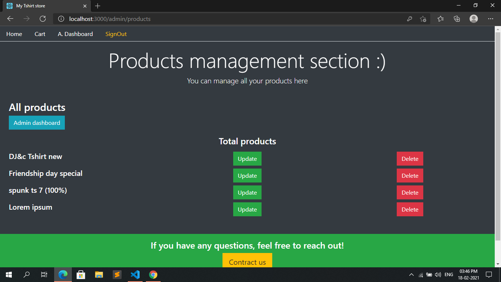

# E-commerce-store
This is an e-commerce t-shirt store with 2 payment gateway integration, using mongoDB, express, react and node (MERN stack). I build this during my LCO MERN Bootcamp.

## Screenshot

